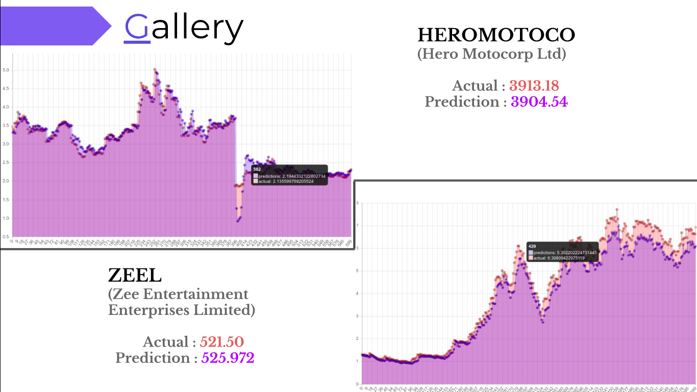
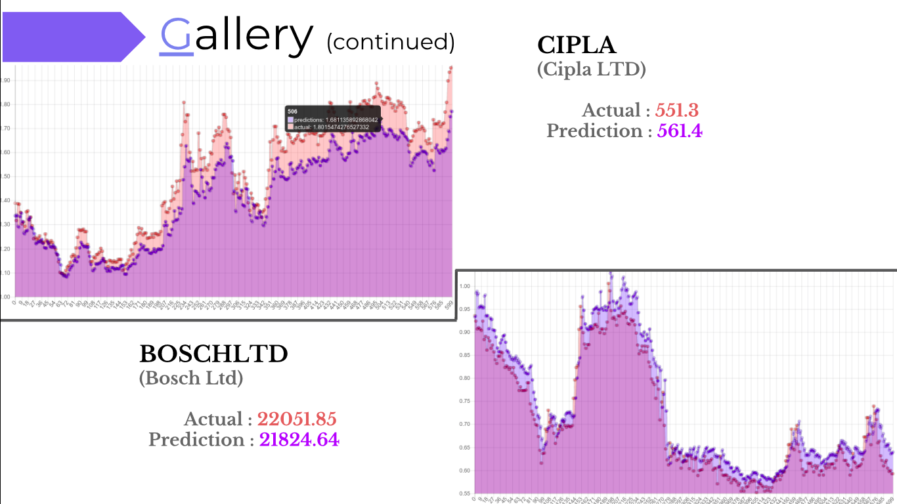

# Stock-Price-Forecasting-Using-Artificial-Intelligence
New approach for stock market prediction using Artificial Intiligance
## Techniques used

> Bidirectional LSTM on historical data

> Sentiment analysis with news and twitter feeds

> Django + Angular JS combination for web app

## Requirements

### Python packages

> LAMP installed

> Django

> celery

> keras

> tensorflow

> pandas

> numpy

### JS packages

> Jquery

> Angular JS

> Chart JS

## How to run 

first terminal
``` bash
git clone git@github.com:koriavinash1/FIN_ishers.git
cd FIN_ishers/StockNest
python manage.py runserver
```

second ternimal
```bash
cd FIN_ishers/StockNest
celery -A StockNest worker -l info
```

## First steps

+ data collection: Once server is on, navigate to localhost:8000/stocksadmin download all the required data

+ train model from same stocksadmin page

+ once model is trained, you can use product from localhost:8000/index paage

## DL model information

+ DL model information can be found in FIN_ishers/StockNest/stock_backend

+ Django restapis can be found from all apps/apis.py script

## Predictions




### Observed RMSE < 0.05 on test data


## Contact 

* Avinash Kori (avinashgkori@smail.iitm.ac.in)

<hr>

If any comments or information required, pull requests/issues are <strong>Welcomed....</strong> 

Thankyou
